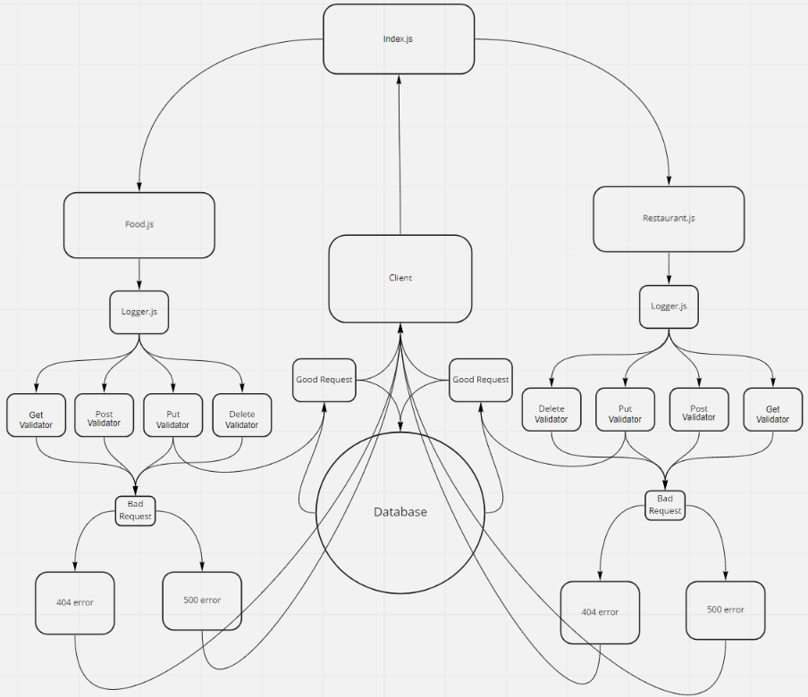

# basic-api-server
Created by Bryce Pfingston

## Installation  
npm i { jest, express, dotenv, supertest, pg, sequelize, sqlite3, seqluelize-cli }  
  
## Summary of Problem Domain  
Testing routes, and testing CRUD on server.

## Links to application deployment  
 
Heroku: https://basic-api-server-bry.herokuapp.com/ 
Githut: https://github.com/bpfingston/basic-api-server
  
## Include embedded UML

## Talk about your routes

Path: /food
HTTP POST - responds with a specific { object } with following key value pairs{title: 'title', typeOfFood: 'typeOfFood'}  
HTTP PUT - responds with updating a specific { object } with following key value pairs{title: 'title', typeOfFood: 'typeOfFood'}  
HTTP GET - responds with all/specfic { object } with following key value pairs{title: 'title', typeOfFood: 'typeOfFood'}  
HTTP DELETE - responds with destroying a specific { object } with following key value pairs{title: 'title', typeOfFood: 'typeOfFood'}  

Path: /restaurant  
HTTP POST - responds with a specific { object } with following key value pairs{title: 'title', typeOfFood: 'typeOfFood'}  
HTTP PUT - responds with updating a specific { object } with following key value pairs{title: 'title', typeOfFood: 'typeOfFood'}  
HTTP GET - responds with all/specfic { object } with following key value pairs{title: 'title', typeOfFood: 'typeOfFood'}  
HTTP DELETE - responds with destroying a specific { object } with following key value pairs{title: 'title', typeOfFood: 'typeOfFood'}